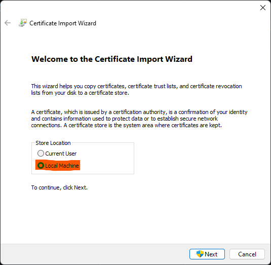

# Installation

## Windows

### Install certificate

To install the MSIX package on Windows, you must first install my certificate to your system's root certificate store. This is because Microsoft requires MSIX packages to be signed and getting an already trusted certificate is expensive. The following steps will only need to be done once.

1. Download the certificate from [here](https://drive.google.com/file/d/19HlKjGMTtUb0HttY2irRpsDkCf2CnzOv/view?usp=sharing).
2. Right-click the certificate file and click _Install Certificate_.
3. Under _Store Location_, select _Local Machine_ and click _Next_.

   

4. Select _Place all certificates in the following store_, then click _Browse_.

   

5. Select _Trusted Root Certification Authorities_ and click _OK_.

   

6. Click _Next_, followed by _Finish_.

### Install package

1. Download the appinstaller from [here](https://github.com/hasali19/zenith/releases/download/flutter%2Flatest/zenith-windows.appinstaller).
2. Open the file and confirm the installation.

   
